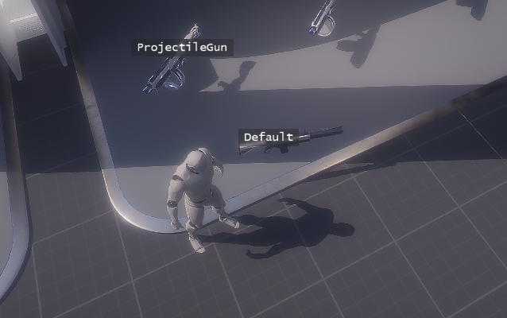
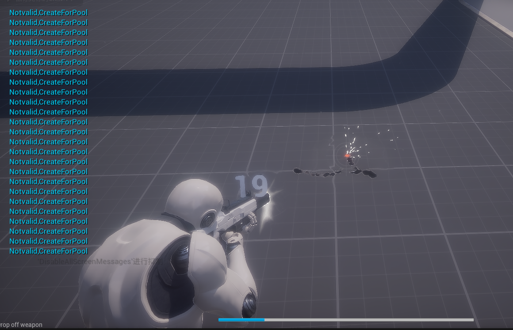
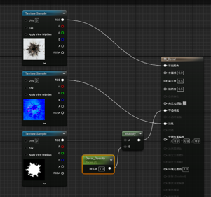
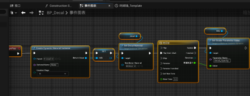
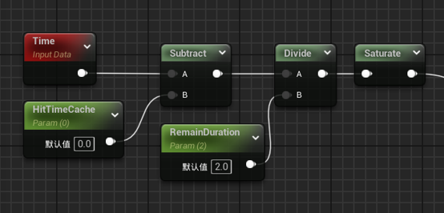
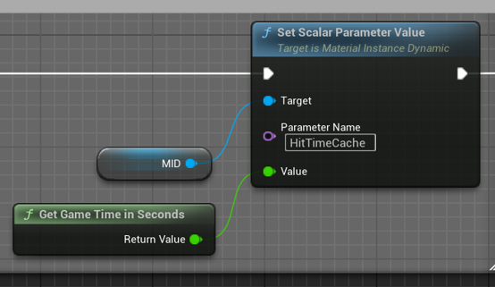
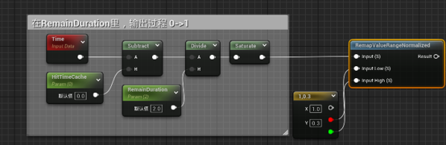

# 机关枪射击产生的 Decal 如何自然消失？
demo中出现的地方：
<p align="center">
  
  
</p>

## 最简单的方法（不推荐）

在 Decal 材质里创建一个 **Scalar 参数**（充当弹孔 Decal 的 Opacity）。然后将 Decal 作为一个 **Actor**（因为这个 Decal 需要一些自己的逻辑，即蓝图内部通过 Tick 类似的手段让 Decal 里的 Opacity Scalar 变化，图中的timeline方法其实就是一种让CPU不停去sample一条Curve然后赋值）（比如蓝图变量一个时间柄time handler，get remained除以float持续时间总长度这种事情，相当于让CPU不断地做除法的归一化运算）。每当机关枪射击，最后用 **Spawn Actor from Class** 去触发（即包含 Decal 组件的一个 Actor）。

<p align="center">
  
  
</p>

但这个方法，我将立刻否决。

- **频繁生成新的 Actor 并快速销毁，GC（Garbage Collection）：你清高，你了不起。**
- 而且，仅仅是为了让 Opacity 发生变化，让 CPU 不停的去 **Set Scalar Parameter Value**（蓝图是运行在 CPU 上的），其实并非最好的办法。

---

## 推荐方案：对象池 + GPU 材质计算

因此，这里采用的是 **对象池**（解放 GC）去管理弹孔，并且将淡出 Opacity 的工作交由**材质本身**处理（GPU 来负责）。

因为标题是"如何让弹孔自然消失"，先讲材质。

### 核心材质片段



材质中使用以下关键节点/参数：

| 参数/节点 | 类型 | 说明 |
|---|---|---|
| **HitTimeCache** | Scalar | 记录弹孔的时间点（也就是机关枪的射击时间点） |
| **RemainDuration** | Scalar | 弹孔存在持续时长（也就是弹孔出现后多久完全淡出） |
| **Time** | 材质节点 | 引擎提供的时间节点，持续递增 |

### 原理详解

还记得之前的方法是通过蓝图里给 Decal Material 的 Scalar 参数不停的进行 Set 吗？让 Timeline 不停的给 Scalar 赋值，传递的值从 1 一直经过中间一堆 float 一直赋值到 0。

**没错，材质里的 `Time`：上面这些工作，我承包了！**

#### 计算过程

1. **射击瞬间**：蓝图让 Decal 出现后，只需要**记录一次**这个 Decal 是什么时候出现的（写入 `HitTimeCache`）。

   

2. **时间流逝**：游戏时间（Game Time）会继续前进，不断增加。材质里的 `Time` 也一起不断变大。

3. **计算 ΔT**：
   ```
   ΔT = Time - HitTimeCache
   ```

   例如：在 Game Time = 2s 时射击：
   - Game Time 从 2 → 3 的过程中，ΔT 的值从 0 → 1
   - （这是在 `RemainDuration` 默认为 1 的情况下）

4. **延长持续时间**：
   为了让弹孔存在更久，引入 `RemainDuration` 做除法：
   ```
   ΔT = (Time - HitTimeCache) / RemainDuration
   ```

   假设 `RemainDuration = 2`：
   - Game Time 从 2 → 3 时，ΔT 从 (2-2)/2 = **0** → (3-2)/2 = **0.5**
   - 原本 1 秒能走完的量现在只走到 0.5
   - 只有当 Game Time = 4 时，(4-2)/2 = **1**，ΔT 才真正抵达 1

   因此，需要 `RemainDuration` 秒才能完成这个过程。弹孔从出现到完全消失也就需要 `RemainDuration` 秒。

5. **输出 Opacity**：
   - 对 ΔT 进行 **Saturate**（将值钳制在 0-1 范围内）
   - 使用 **One Minus**（1 - ΔT）得到淡出效果
   - 可以配合 **RemapValueRangeNormalized** 实现更精细的控制：
     - 例如：弹孔诞生后，2×0.3s 内完全是实心（Opacity = 1）
     - 之后开始缓慢淡出，2s 内完全消失

   

### 关键优势

原本交给 CPU 去算弹孔透明度的事情，现在转由 GPU 来处理（材质是在 GPU 上计算的）。避免了每帧通过蓝图 Set Scalar Parameter Value 的 CPU 开销。

---

## 注意事项

这个 Decal 所挂的 Decal Actor，**并不会因为材质让他看上去消失了，而 Actor 消失**。实际上 Decal 作为半透明依然在那里和原像素做混合运算（只不过 Opacity 为 0 而已，但 0 不代表就不算了）。

因此，在淡出结束后，蓝图侧 CPU 还是得帮忙做一下 **Set Actor Hidden** 的事情（不是 Destroy，因为前面使用的是对象池的逻辑）。

---

## 关于对象池

对象池暂时不介绍了（也有可能🕊，毕竟标题可不是说来介绍弹孔处理的，而是说弹孔的淡出）。

啊啊啊啊懒癌发作了发作了（写点东西防止整个md没有一点人味）
啊啊啊我是听着 Aid - Cataclysm Cry (From ARCAEA 7.0) 写的这个word文档（然后让kimi帮我写个md的）

## 其他
不过我这么做是因为我是 落  后 的UE544，现在的UE可以把decal直接当作粒子，在niagara中通过NDC去实现频繁的机关枪射击的 弹孔产生（544的NDC缺乏一些必要的功能所以无法用niagara做），可以找epic官方的 Niagara Example（高版本ue，比如574 582）看看。https://www.fab.com/listings/0e188eca-4e54-4fb2-a9ed-d8b8a565e600

## 来一张夹竹桃镇楼
<a href="https://www.bilibili.com/bangumi/play/ss39947">

</a>