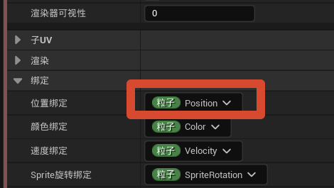
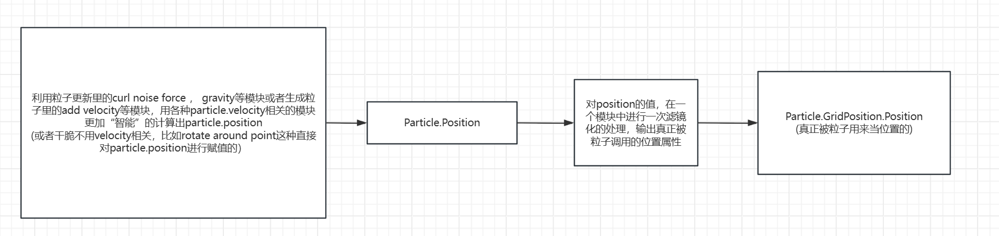
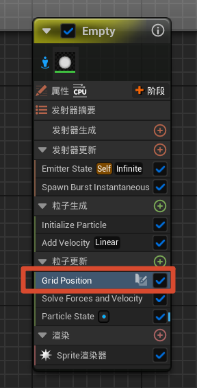
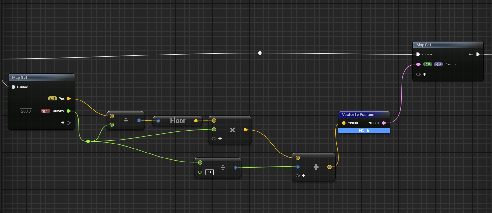
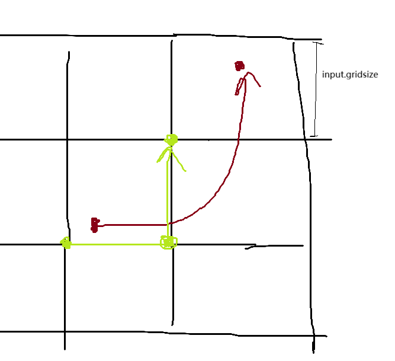

# 如何让粒子走出电路一样的grid格子一般的效果？
效果：
 
<video src="./PixPin_2026-09-03_20-03-48.mp4" width="45%" controls muted loop>
  你的浏览器不支持视频标签
</video>

## 后处理思路

众所周知，niagara的粒子的位置属性默认由Particle.Position控制。

而我用的方法，实际上就是对Particle.Position上一层滤镜一般的处理。思路大致如图下所示

那么能够输出最终使用的属性即Particle.GridPosition.Position，滤镜是这个模块。

而他的写法很简单，拿到Particle.Position就做这么一点事情。

这里的 Local.Position 在前面是直接拿了 Particle.Position 赋值

公式实际上就是有时候在材质里中（尤其是后处理中）对WorldPosition搞格子化的时候常用的公式，

公式也就是-先除再底后乘回来（最后的对gridsize的/2相加可有可无，如果轨迹是从中心发出，这个简单的相加处理可以保证粒子从中心出发罢了）

只不过在这里，公式直接挪给粒子来用（给粒子上一层滤镜，就像材质中给WorldPosition变成一个网格化的东西，纯滤镜好吧）

使用之后，假设图中粒子Particle.Position的值的变化其实是这样（也就是原本渲染器使用的粒子属性，sprite的走势），再替换为滤镜化后的Particle.GridPosition.Position，就会变成绿色的这个。

我给GridPosition模块加了一个input.gridsize作为参数，那么显然的，gridsize越高，snap例子位置的网格也就更大，于是粒子的吸附也就更长且源路径看起来的样子越抽象，而gridsize越低，snap粒子位置的的网格也就更小，于是粒子实际的运动轨迹就会和滤镜化之前的看起来更相似（但是看着会更像素化一些）

最后通过各种手段（比如CPU发射器可以用generate location event，GPU用sample other emitter）来给这些粒子加上条带（记得开粒子携带固定ID属性！）

作为对比，来看一下实际视频

<video src="./PixPin_2026-09-03_20-50-06.mp4" width="85%" controls muted loop>
  你的浏览器不支持视频标签
</video>

（未使用GridPosition）

<video src="./PixPin_2026-09-03_20-53-00.mp4" width="85%" controls muted loop>
  你的浏览器不支持视频标签
</video>

（使用GridPosition）

## 优点缺点？

优点很明显：后处理思想，简单，无脑，快速实现

但是缺点也显而易见。如果Gridsize设置为一个较大的值，那么Particle.GridPosition.Position发生值的跳变，必须取决于原来的Particle.Position是否经过了较大的距离值。但是呢在这个过程中，ribbon也就是拖尾的部分依旧在不停的喷射（不管其id绑定的parent粒子，也就是正在使用Particle.GridPosition.Position是否依旧在snap的网格点上，粒子根本没有移动，但ribbon依旧在发生，spawncount依旧在上升，但实际视觉效果上根本没用，纯浪费）

不过如果真的用一些迭代的方法，比如粒子更新中反复检查当前的粒子，用一些特殊的计算公式去算接下来的位置，啥的，但是我不会。

不过在实现类似的效果上，这种后处理方法我认为可以把复杂问题大幅度的简单化（（（

对于我这种铸币大脑来说再合适不过了

## 依旧夹竹桃镇楼
